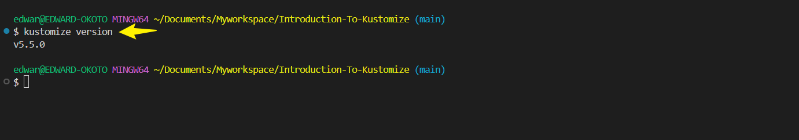
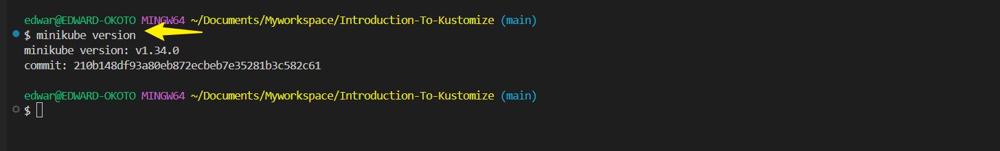
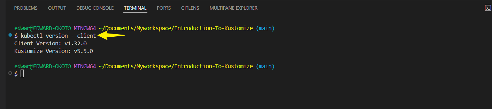
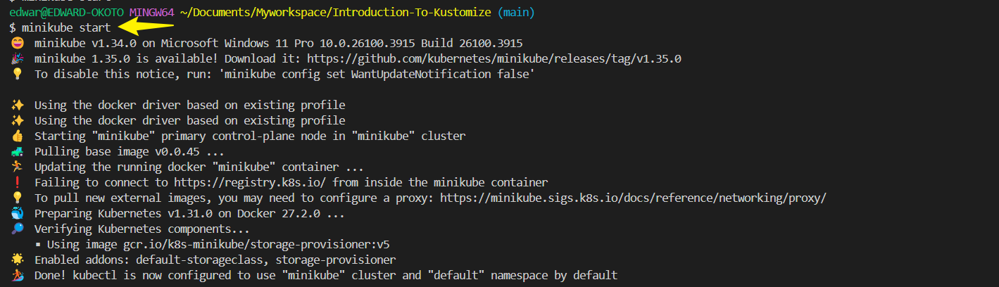
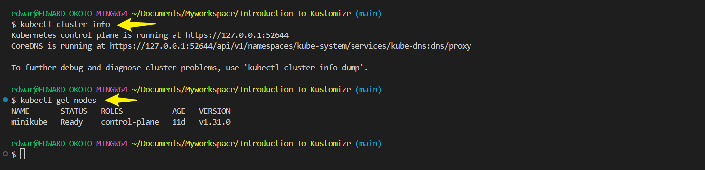
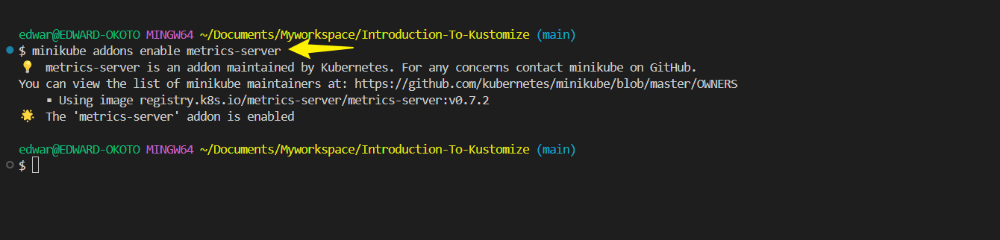
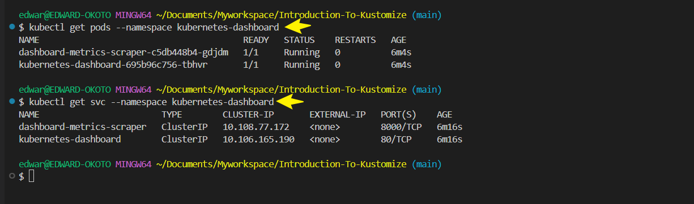
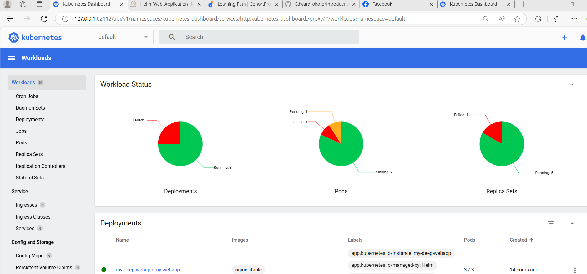

# Introduction-To-Kustomize

## Introduction to Configuration Management In Kubernetes With Kustomize

#### Lesson 1. Understanding Kubernetes configurations

#### Objectives: Familiarization with kubernetes Objects and Configuration.

Kubernetes, often abbreviated as **K8s**, is an **open-source container orchestration platform** that automates the deployment, scaling, and management of containerized applications. 

#### ✅ **Core Components**
1️⃣ **Pods** – The smallest unit in Kubernetes, **containers run inside pods**.  
2️⃣ **Deployments** – Define how pods should be **created, updated, and managed**.  
3️⃣ **Services** – Help expose pods and provide **networking and load balancing**.  
4️⃣ **Namespaces** – Logical grouping to **organize resources** (e.g., `default`, `kube-system`).  
5️⃣ **ConfigMaps & Secrets** – Store configuration data **externally** from container images.

#### ✅ **Why Kubernetes?**
✔ **Automates Scaling** – Handles traffic spikes automatically.  
✔ **Self-Healing** – Restarts failed pods automatically.  
✔ **Declarative Management** – Define system state via **YAML manifests**.  
✔ **Load Balancing & Service Discovery** – Efficiently routes requests.

---

### ✅ **Kubernetes Architecture**
At a high level, Kubernetes consists of several key components:

#### 1️⃣ **Control Plane** (Manages the cluster)
The control plane makes decisions about cluster state and **ensures desired configurations are maintained**. It consists of:
- **API Server (`kube-apiserver`)** – The central communication hub that exposes the Kubernetes API and processes requests.
- **Scheduler (`kube-scheduler`)** – Assigns workloads (pods) to nodes based on resource availability.
- **Controller Manager (`kube-controller-manager`)** – Ensures objects (deployments, replicasets, etc.) reach their desired state.
- **ETCD** – Stores cluster configuration as a consistent and distributed key-value store.

#### 2️⃣ **Worker Nodes** (Runs applications)
Each worker node hosts application workloads and runs:
- **Kubelet** – The agent that ensures containers on the node are running correctly.
- **Container Runtime (Docker/Containerd/CRI-O)** – Runs the actual containers.
- **Kube Proxy** – Manages networking and load balancing between pods.

---

#### ✅ **Kubernetes Functionality**
Kubernetes automates the lifecycle of containerized applications using several powerful features:

#### **Pods & Replication**
A **pod** is the smallest deployable unit in Kubernetes, containing one or more containers.  
You can manage pod replicas with:
- **ReplicaSets** – Ensures a specified number of identical pods are always running.
- **Deployments** – Handles rollout updates and scaling.

#### **Networking & Service Discovery**
Kubernetes provides multiple ways to communicate between services:
- **ClusterIP** – Internal service access within the cluster.
- **NodePort** – Exposes services on a node’s IP.
- **LoadBalancer** – Enables external access with cloud providers.
- **Ingress** – Routes external HTTP/S traffic to services inside the cluster.

#### **Storage Management**
For persistent data, Kubernetes supports:
- **Persistent Volumes (PV)** – Abstract storage that persists beyond pod lifetimes.
- **Persistent Volume Claims (PVC)** – Requests storage from PVs dynamically.
- **Storage Classes** – Defines how storage is allocated dynamically.

#### **Security & Configurations**
Kubernetes ensures **secure deployments** using:
- **ConfigMaps & Secrets** – Manages environment variables and credentials securely.
- **Role-Based Access Control (RBAC)** – Controls permissions for users and applications.
- **Network Policies** – Defines allowed communication between pods for better security.

---

## Introduction To Kustomize

### Objective: Understand Kustomize role in kubernetes

Kustomize is a **native Kubernetes tool** that simplifies the customization of Kubernetes configurations **without modifying the original YAML files**. It allows users to manage multiple deployment environments (e.g., **dev, staging, production**) and reuse configurations efficiently.

---

#### ✅ **Key Role of Kustomize in Kubernetes**
1️⃣ **Overlay-Based Customization**  
   - Instead of modifying base YAML files, Kustomize applies **overlays** to extend or override configurations.
   - Makes configuration management **cleaner and more scalable**.

2️⃣ **Declarative Resource Patching**  
   - Allows easy modifications to Kubernetes objects **without directly editing manifests**.
   - You can change labels, annotations, images, or replica counts using **patches**.

3️⃣ **Environment Management**  
   - Provides a structured way to configure different environments (**dev, test, prod**).
   - Helps teams manage deployment variations efficiently.

4️⃣ **Improves GitOps Workflows**  
   - Works seamlessly with version-controlled YAML files.
   - Reduces conflicts when handling Kubernetes manifests across teams.

---

### ✅ **How Kustomize Works**
Kustomize uses a **`kustomization.yaml`** file to define modifications on base Kubernetes manifests.

Example **folder structure**:
```
k8s-config/
  ├── base/
  │   ├── deployment.yaml
  │   ├── service.yaml
  │   └── kustomization.yaml
  ├── overlays/
  │   ├── dev/kustomization.yaml
  │   ├── staging/kustomization.yaml
  │   └── prod/kustomization.yaml
```
The `kustomization.yaml` file defines customizations such as **patching images, labels, or adding resources**.

To apply Kustomize, run:
```sh
kubectl apply -k overlays/dev
```
✔ This **applies all configurations** from the `dev` overlay.

--- 

## Setting Up The Environment.

#### Objectives: Install Kustomize and Set Up a Basic Kubernetes Cluster.

##### TASK1: Install Kustomize.
- Kustomize is a tool that allows you to customize raw, template free YAML files for multiple purpose, 
essential for kubernetes deployments.

Detailed steps for Linux.

To install **Kustomize** on Linux, follow these steps:

#### ✅ **Option 1: Install via `kubectl` (Built-in)**
Kustomize is **included** in `kubectl` versions **1.14 and later**, so you can use:
```sh
kubectl kustomize --help
```
✔ If `kubectl` supports it, no additional installation is needed!

---

#### ✅ **Option 2: Install Kustomize Manually**
1️⃣ **Download the Latest Kustomize Release**
   ```sh
   curl -s https://api.github.com/repos/kubernetes-sigs/kustomize/releases/latest | \
   grep browser_download_url | grep linux | cut -d '"' -f 4 | xargs curl -O
   ```
   ✔ This fetches the latest Linux version from GitHub.

   OR visit [kustomize Github Repository](https://github.com/kubernetes-sigs/kustomize/releases)
   - Select the version that is suitable for your linux operating system.Look for a file that ends with `linux_amd64.tar.gz`
   - Download the `tar.gz` file: Click on the link the `linux_amd64.tar.gz` file to download it.
   -Navigate to the Download directory : Use the cd command to navigate to the directory where the downloaded file is located.


2️⃣ **Extract and Move Binary**
   ```sh
   tar -xvzf kustomize_v*.tar.gz
   mv kustomize /usr/local/bin/
   ```
   ✔ Moves `kustomize` to a directory in your `$PATH`.

3️⃣ **Verify Installation**
   ```sh
   kustomize version
   ```
   ✔ If installed, it will output version details.

   

---

### ✅ **Option 3: Install via `go get` (For Developers)**
If you have Go installed, you can build Kustomize directly:
```sh
go install sigs.k8s.io/kustomize/kustomize/v5@latest
```
✔ This installs Kustomize **via Go**.

---

##### TASK2: Set Up a Mini Kubernetes Cluster With Minikube.

Minikube is a that runs a single-node kubernetes cluster locally on your machine. Setting up a **mini Kubernetes cluster** using **Minikube** is a great way to experiment with Kubernetes on your local machine! 

---

##### ✅ **Step 1: Install Minikube**
1️⃣ **Install Virtualization Software**  
Minikube requires a hypervisor. Install one based on your OS:
- **Windows**: Install **Hyper-V** (or VirtualBox).
- **macOS**: Use the built-in **HyperKit** or VirtualBox.
- **Linux**: Install **KVM** or VirtualBox.

2️⃣ **Download and Install Minikube**  
For Linux/macOS:
```sh
curl -LO https://storage.googleapis.com/minikube/releases/latest/minikube-linux-amd64
sudo install minikube-linux-amd64 /usr/local/bin/minikube
```
For Windows:
- Download the Minikube `.exe` from [Minikube Releases](https://minikube.sigs.k8s.io/docs/start/)
- Move the executable to `C:\Program Files\Minikube\`

Verify installation:
```sh
minikube version
```


---

##### ✅ **Step 2: Install `kubectl` (Kubernetes CLI)**
1️⃣ **Install kubectl**  
For Linux/macOS:
```sh
curl -LO "https://dl.k8s.io/release/$(curl -s https://dl.k8s.io/release/stable.txt)/bin/linux/amd64/kubectl"
sudo install kubectl /usr/local/bin/kubectl
```
For Windows, download the `.exe` from [kubectl Releases](https://kubernetes.io/docs/tasks/tools/install-kubectl-windows/).

Verify installation:
```sh
kubectl version --client
```


---

##### ✅ **Step 3: Start Minikube**
1️⃣ Start the cluster:
```sh
minikube start
```


✔ This spins up a **single-node Kubernetes cluster**.

2️⃣ Check cluster status:
```sh
kubectl cluster-info
kubectl get nodes
```


3️⃣ Enable the Minikube dashboard (optional):
```sh
minikube dashboard
```
✔ Opens the web UI for monitoring.

##### ✅ **Next Steps**
1️⃣ **Enable Metrics-Server for Full Dashboard Features**  
Run:
```sh
minikube addons enable metrics-server
```


✔ This **activates resource monitoring**, including CPU & memory stats.

2️⃣ **Verify Running Pods & Services**  
Check what’s active inside your cluster:
```sh
kubectl get pods --namespace kubernetes-dashboard
kubectl get svc --namespace kubernetes-dashboard
```


✔ Ensures the dashboard **has connectivity**.

3️⃣ **Access Dashboard Again**  
If needed, restart the proxy:
```sh
minikube dashboard
```
✔ Opens the UI in your browser.



 


